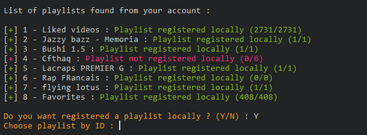
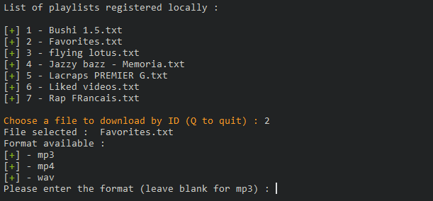

# Youtube's thief

 

Allows you to upload audio from youtube videos and playlists,

> development in progress

## Installation
    It's better to create a virtualenv
    Use pip install -r requirement.txt to install all dependencies

## Prerequisites before use
> Check the youutbe api documentation : [Documentation](https://developers.google.com/youtube/v3/guides/auth/server-side-web-apps?hl=fr)

    1 - Create an api key for youtube-api, follow documentation above
    2 - Add your token in a file client_secrets.json in credentials folder
    3 - Launch "python main.py"
    4 - Select your profile from youtube to authenticate 
    5 - A file named token.pickle will be created in the credentials folder for future use

## Environment
    Pyhton3

## How it works
    python main.py --help to have all commands
    python main.py -l to list all your playlist from your account

    The first step is to save the playlists locally
    The playlists will be registered in uploads folder ready to download : 

    

    (IN PROGRESS)
    Once the playlist is saved, you can download it from the command: 
    => python main.py --download to download playlistys registred locally : 

    Each video will be downloaded in downloads/ folder

    => python main.py --download https://youtube.com?list=zergvrezgreh to download playlist
    OR unique video :

    

